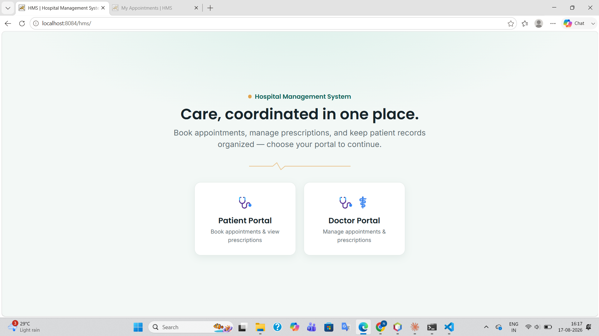
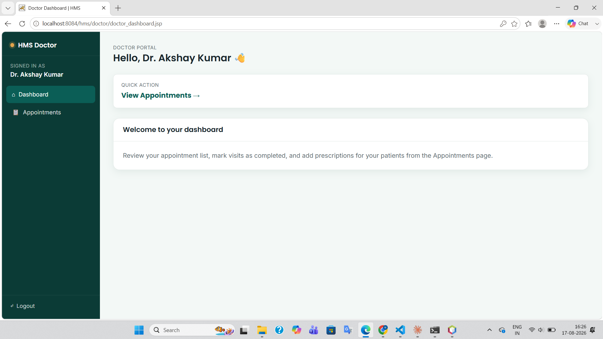
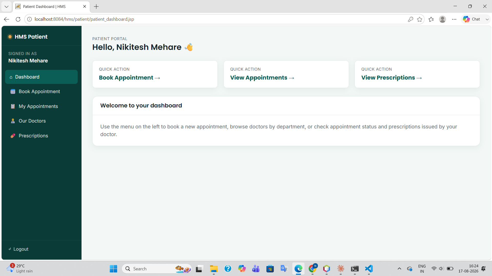
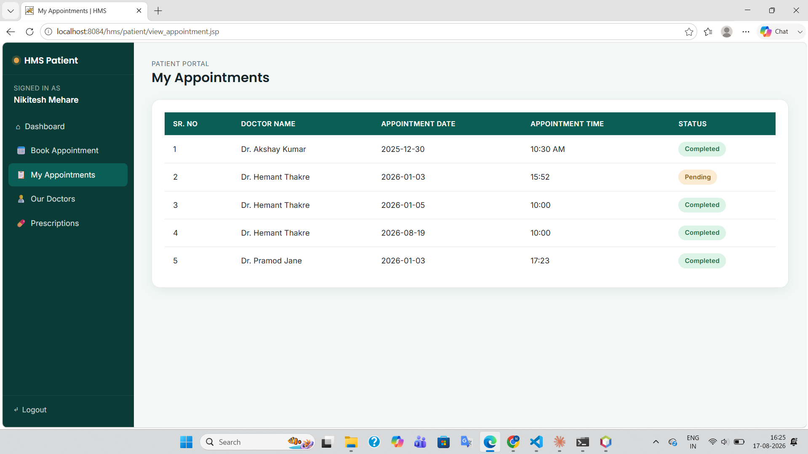
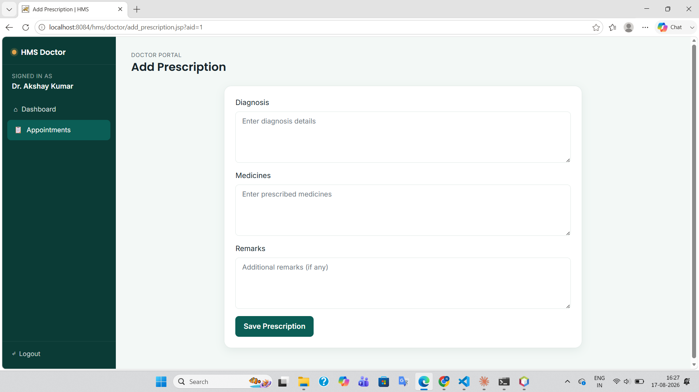
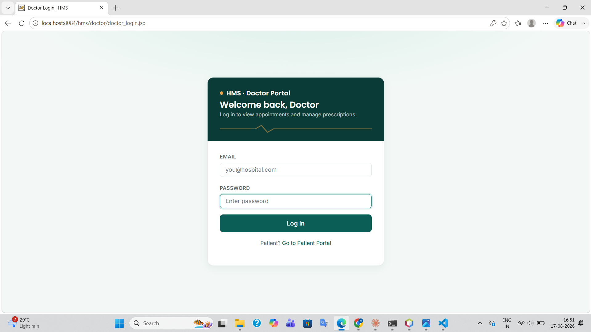
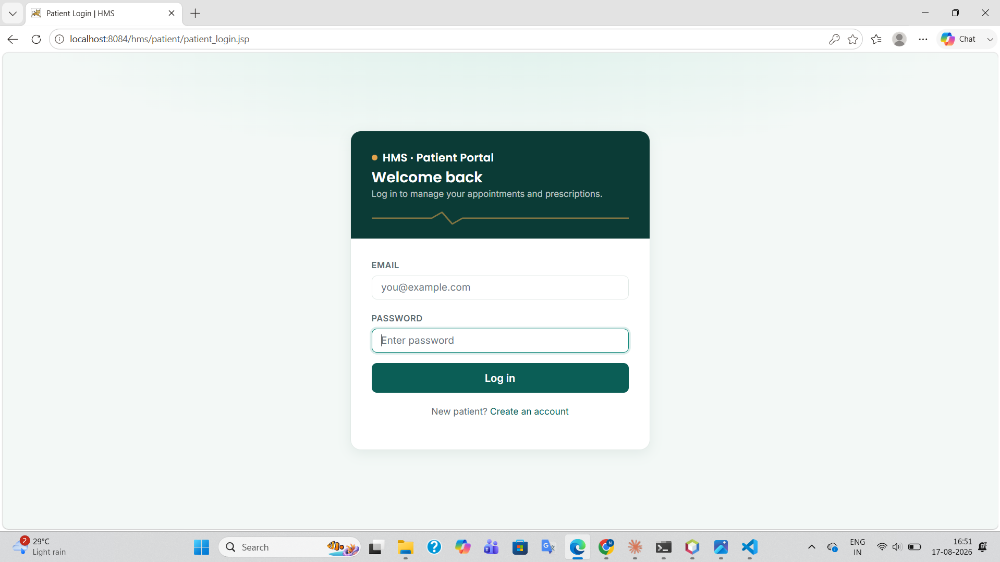

# 🏥 Hospital Management System (HMS)

A full-stack Hospital Management System built from scratch using **Core Java, JSP, Servlets, and JDBC**, following the **MVC architecture**. It supports two independent portals — **Patient** and **Doctor** — for appointment booking, doctor discovery, and prescription management.

Live demo: _add your Render URL here once deployed_
Repository: `https://github.com/Nikitesh-Mehare/hms`

---

## ✨ Features

### Patient Portal
- Patient registration and login (session-based auth)
- Book an appointment with a doctor (date & time selection)
- View all booked appointments with live status (pending / completed / cancelled)
- Browse doctors by department
- View prescriptions issued by doctors, per appointment

### Doctor Portal
- Doctor login (session-based auth)
- View all appointments assigned to the logged-in doctor
- Add a prescription (diagnosis, medicines, remarks) for any appointment
- Mark an appointment as completed

---

## 🛠 Tech Stack

| Layer          | Technology                                   |
|----------------|-----------------------------------------------|
| Frontend       | HTML, CSS, JavaScript, Bootstrap 4, JSP       |
| Backend        | Java Servlets (Controller layer)              |
| Data Access    | JDBC, DAO pattern                             |
| Database       | MySQL                                         |
| Architecture   | MVC (Model–View–Controller)                   |
| Build / IDE    | Apache Ant, Apache NetBeans                   |
| Server         | Apache Tomcat 9                               |
| Deployment     | Docker, Render (Tomcat container)             |

---

## 🏗 Architecture (MVC)

```
Browser (JSP views)
      │
      ▼
Servlets (Controller)  →  registerPatientServlet, loginPatientServlet,
                           LoginDoctorServlet, BookAppointmentServlet,
                           AddPrescriptionServlet, UpdateAppointmentStatusServlet
      │
      ▼
DAO layer (com.hms.dao)  →  PatientDAO, DoctorDAO, AppointmentDAO, PrescriptionDAO
      │
      ▼
DbConnection (JDBC)  →  MySQL database (hospitaldb)
```

- **Model** — POJOs in `com.hms.model` (`Patient`, `Doctor`, `Appointment`, `Prescription`)
- **View** — JSP pages under `web/patient/` and `web/doctor/`
- **Controller** — Servlets in `com.hms.controller`

---

## 📁 Project Structure

```
hms/
├── src/java/com/hms/
│   ├── controller/     # Servlets
│   ├── dao/             # Database access objects
│   ├── model/            # POJOs
│   └── util/              # DbConnection (JDBC)
├── web/
│   ├── assets/css/theme.css   # Shared frontend design system
│   ├── patient/                # Patient-facing JSP pages
│   ├── doctor/                  # Doctor-facing JSP pages
│   ├── WEB-INF/web.xml           # Servlet mappings
│   └── index.html                 # Landing page
├── Dockerfile
├── DEPLOY.md
└── build.xml           # Ant build script (NetBeans-generated)
```

---

## 🗄 Database Schema (overview)

| Table         | Key Columns                                                        |
|---------------|---------------------------------------------------------------------|
| `patient`     | patient_id, patient_name, email, password, gender, contact, address |
| `doctor`      | doctor_id, doctor_name, email, password, dept_id                    |
| `department`  | dept_id, dept_name                                                   |
| `appointment` | appointment_id, patient_id, doctor_id, appointment_date, appointment_time, status |
| `prescription`| appointment_id, diagnosis, medicines, remarks                        |

> Create the database as `hospitaldb` and run your table-creation scripts before starting the app.

---

## 🚀 Getting Started (local setup)

### Prerequisites
- JDK 17+
- Apache Tomcat 9
- MySQL Server
- Apache NetBeans (recommended, project is Ant-based)

### Steps
1. Clone the repo:
   ```bash
   git clone https://github.com/Nikitesh-Mehare/hms.git
   ```
2. Create a MySQL database named `hospitaldb` and import the schema.
3. Open the project in NetBeans.
4. `DbConnection.java` connects to `jdbc:mysql://localhost:3306/hospitaldb` with `root` / `root` by default — update these if your local MySQL credentials differ.
5. Right-click the project → **Run** (or **Clean and Build** to generate `dist/hms.war`).
6. Visit `http://localhost:8080/hms/` in your browser.

---

## ☁️ Deployment

This app is deployed as a Docker container running Tomcat 9, since JSP/Servlet apps need a Java servlet container (not supported on static/serverless hosts like Vercel). Full steps are in [`DEPLOY.md`](./DEPLOY.md).

`DbConnection.java` reads `DB_URL`, `DB_USER`, and `DB_PASSWORD` from environment variables in production, falling back to local defaults for development — no code changes needed between environments.

---

## 📸 Screenshots
---













---

## 👤 Author

**Nikitesh Mehare**
GitHub: [@Nikitesh-Mehare](https://github.com/Nikitesh-Mehare)

---

## 📄 License

This project is open source and available for learning purposes.
